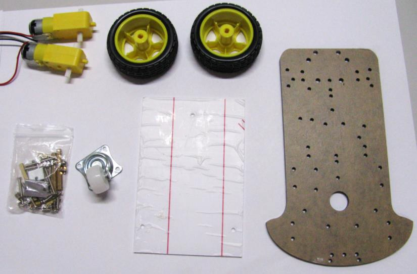
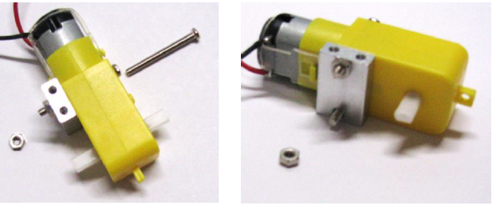
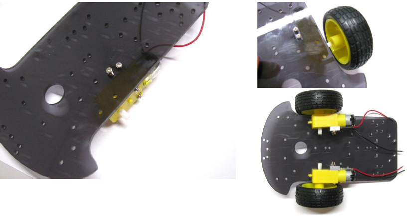
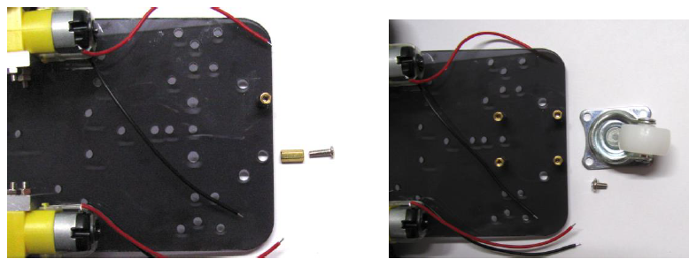
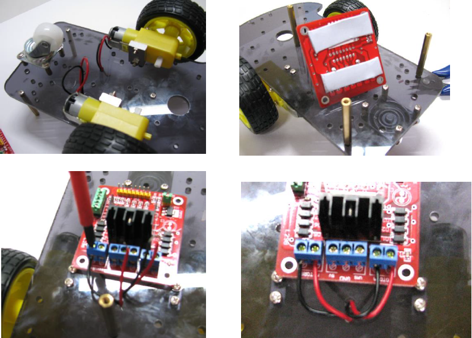
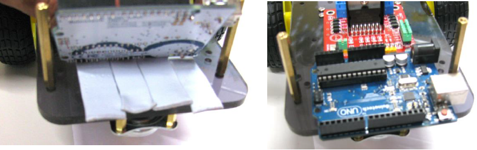
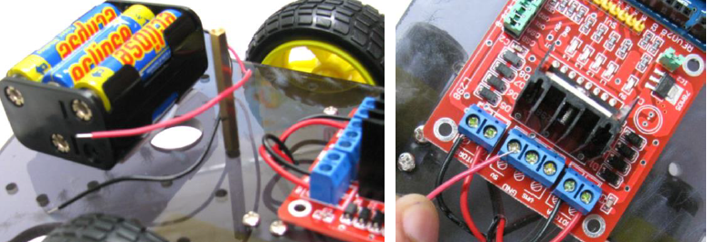
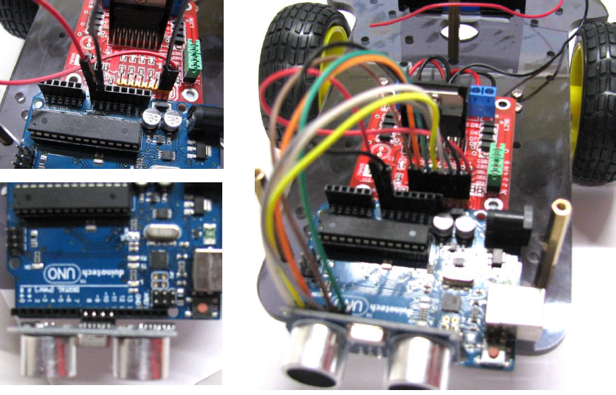

# Wall Dodging Robot
_Project 00001_

This clever robot is the perfect way to get started with robotics. The robot explores
its surroundings as it avoids obstacles and walls in its path. Starting with the
provided code, the robot can easily be expanded upon.

## Bill of Materials
| Qty | Code | Description |
| --- | --- | ---|
|1 | [XC4410](http://jaycar.com.au/p/XC4410) | Duinotech UNO board
|1 | [XC4442](http://jaycar.com.au/p/XC4442) | Ultrasonic Sensor
|1 | [XC4492](http://jaycar.com.au/p/XC4492) | Stepper motor controller
|1 | [KR3160](http://jaycar.com.au/p/KR3160) | 2WD Motor chassis kit
|1 | [WC6028](http://jaycar.com.au/p/WC6028) | plug to socket jumper lead 40 pack
|1 | [PH9206](http://jaycar.com.au/p/PH9206) | 6AA battery holder

## Connection Table
### UNO and Motor Controller
| UNO | Motor Controller |
| --- | --- |
|5V| 5V |
|GND | GND |
| D6 | ENA |
| D4 | IN1
|D7 | IN2
|D3 | IN3
|D2 | IN4
|D5 | ENB

* Left and right motors go into MOTORA and MOTORB. if you find the robot turning or
moving backwards unexpectedly , just swap the motor wires around.

* Ultrasonic sensor fits into D8 D9 D10 D11 on the arduino.

## Downloads
* [Source code](http://github.com/duinotech/Wall-Dodging-Robot/archive/master.zip)

## Software Libraries
|Library | Author
| --- | --- |
| N/A | N/A |

## Assembly

Unpack the 2WD motor chassis kit and you should find the Perspex chassis base,
a clear Perspex top, two rear wheels, one front wheel, two motor gearboxes and
mounting accessories.

### 1. Connect the motor mounts
In the mounting kit you will find two aluminum blocks, and four long screws
with associated nuts. You will need these to mount the wheels to the base chassis. Follow the diagrams below to mount the brackets to each of the two motors.

### 2. Connect motor and wheels to chassis

Once you have the two motors with the brackets mounted, locate the motor mounting holes on with side of the base chassis, shown in the below diagram. Using two short screws mount the motor to the chassis as shown below. You should now have two motors mounted on either side of the chassis, now insert a wheel in each side as shown below.

### 3. Connect the front wheel

There are four holes at the front of the chassis that will be used to mount the front wheel. First you will need to mount the short standoffs using the four short screws as shown in the diagram below. Once the four standoffs are mounted (as shown below), you can install the front wheel using the short screws (these are the shortest screws in the kit, with a flange header), as shown below.

### 4. Mount the motor controller

Before mounting the Stepper Motor Controller Module (XC4492), pass the motor wires through a hole from the bottom of the chassis to the top of the chassis, as shown below. You are now ready to mount the Stepper Motor controller board, we used Blue Tac to achieve this, and it works just fine. You can also use double sided tape or you may even want to drill holes in the chassis that align with the controller board mounting holes and use your own standoffs.
Once the controller board is mounted, you will need to connect the motor wires to the board terminals labelled MOTORA and MOTORB respectively. You can do this by suing a screw driver to loosen the terminal screw, insert the respective wire into the terminal, and tighten the screw so that the wire is firmly held in the terminal unit.

_Note: Make sure the ends of the wires are sufficiently stripped back, to ensure the terminals make good contact with the wires._

### 5. Mount the arduino board
We used plenty of blue tac to mount our Arduino board to the chassis, as can be seen in the below diagram. The reason for this was to provide sufficient insulation between the Arduino board and the metal screw heads beneath it (otherwise the metal screw heads may come in contact with the Arduino board and cause a short circuit.

### 6. Mount the battery holder
Insert five AA batteries in the battery holder, you will insert the sixth batter at the very end, when you’re ready to run your robot. We used blue tac to mount the battery holder to the back of the robot chassis, as shown below. Once the battery holder is mounted, you will need to connect the battery power wires (red-5V, and black-GND) to the Motor controller, using a screw driver loosen the terminal marked GND, insert the black wire from the battery holder to this terminal. Now repeat the same for the red wire, only this time insert the red wire into the terminal marked 5V.

### 7. Wire it all up
Using the hook-up wire connect the following terminals between the Stepper Motor Controller and the Arduino. The Ultrasonic Sensor (1 x XC4442) simply inserts into the Arduino board, into pins 8,9,10 and 11, no wiring is required.

## Programming
Download the source code and extract into a new folder, open the .ino file in the Arduino IDE and press upload.

## Use
Place the sixth battery into the unit. The robot should roam around on its own accord and avoid a majority of obstacles.

## Future Improvements
* Use multiple ultrasonic sensors to have a finer degree of control and direction.
