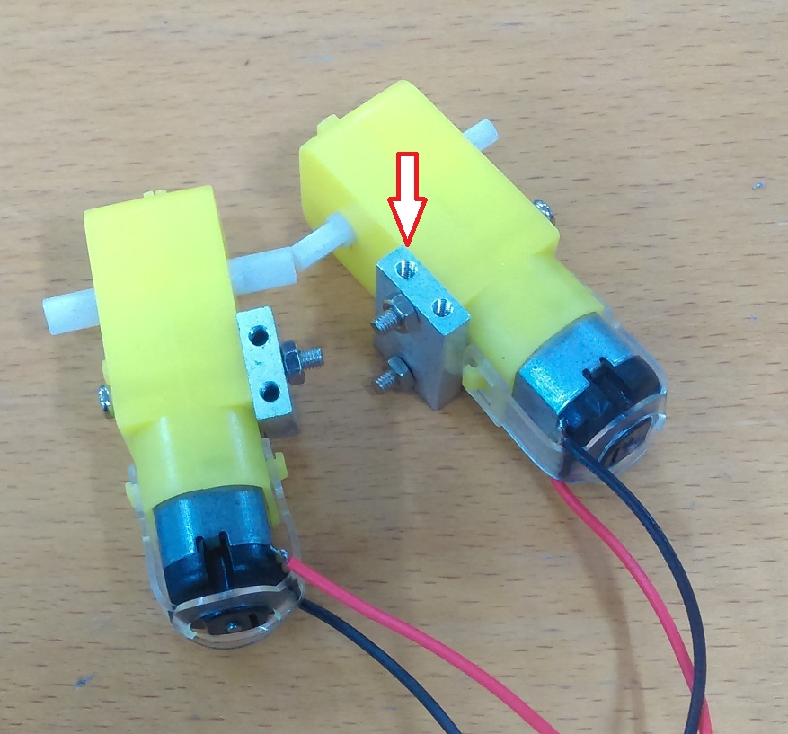

# Wall Dodging Robot

This clever robot is the perfect way to get started with robotics. The robot explores
its surroundings as it avoids obstacles and walls in its path. Starting with the
provided code, the robot can easily be expanded upon.

- [Wall Dodging Robot](#Wall-Dodging-Robot)
  - [Bill of Materials](#Bill-of-Materials)
    - [You might also want](#You-might-also-want)
  - [Connection Table](#Connection-Table)
    - [UNO and Motor Controller](#UNO-and-Motor-Controller)
  - [Assembly of the chassis](#Assembly-of-the-chassis)
    - [Assemble the motor mounts](#Assemble-the-motor-mounts)
    - [Centre wheel assembly](#Centre-wheel-assembly)
    - [Attaching electronics](#Attaching-electronics)
    - [4. Mount the motor controller](#4-Mount-the-motor-controller)
    - [5. Mount the arduino board](#5-Mount-the-arduino-board)
    - [6. Mount the battery holder](#6-Mount-the-battery-holder)
    - [7. Wire it all up](#7-Wire-it-all-up)
  - [Programming](#Programming)
  - [Use](#Use)
  - [Future Improvements](#Future-Improvements)

## Bill of Materials

| Qty | Code                                     | Description                        |
| --- | ---------------------------------------- | ---------------------------------- |
| 1   | [XC4410](https://jaycar.com.au/p/XC4410) | UNO board                          |
| 1   | [XC4442](https://jaycar.com.au/p/XC4442) | Ultrasonic Sensor                  |
| 1   | [XC4492](https://jaycar.com.au/p/XC4492) | Motor controller board             |
| 1   | [KR3160](https://jaycar.com.au/p/KR3160) | 2 wheeled robotic platform         |
| 1   | [WC6028](https://jaycar.com.au/p/WC6028) | plug to socket jumper lead 40 pack |
| 1   | [PH9206](https://jaycar.com.au/p/PH9206) | 6AA battery holder                 |

### You might also want

- Bootlace crimps, for terminals: {PT4533}
- 40 pack of AA batteries: {SB2328}
- Double-sided tape: {NM2821}

## Connection Table

### UNO and Motor Controller

| UNO | Motor Controller |
| --- | ---------------- |
| 5V  | 5V               |
| GND | GND              |
| D6  | ENA              |
| D4  | IN1              |
| D7  | IN2              |
| D3  | IN3              |
| D2  | IN4              |
| D5  | ENB              |

- Left and right motors go into `MOTORA` and `MOTORB`. if you find the robot turning or
  moving backwards unexpectedly , just swap the motor wires around.

- Ultrasonic sensor fits into D8 D9 D10 D11 on the arduino.

## Assembly of the chassis

Unpack the 2WD motor chassis kit and you should find the Perspex chassis base,
a clear Perspex top, two rear wheels, one front wheel, two motor gearboxes and
mounting accessories.

### Assemble the motor mounts

Screw the small metallic blocks to the yellow motor gearboxes. You should be able to find 4 long screws that slide through the motor and bracket to mount the two together.

You must ensure that these are done opposing each other, as they go on each side of the robot chassis

Once they have been put together, attach them to the two holes as shown below, so that the wheel axel sticks out of the chassis.

once they have been placed, you can attach the wheels to the robot by simply pushing them onto the axis.

### Centre wheel assembly

The center wheel of the robot attaches near the smaller straight edge side of the robot platform. use the 4 spacers provided to mount the wheel in the correct position.

### Attaching electronics

In this project we simply use some double sided tape to mount the motor controller to the platform. Bring the 4 wires from the motors up to the `MOTORA` and `MOTORB` terminals, being sure not to cross the wires.

### 4. Mount the motor controller

Before mounting the Stepper Motor Controller Module (XC4492), pass the motor wires through a hole from the bottom of the chassis to the top of the chassis, as shown below. You are now ready to mount the Stepper Motor controller board, we used Blue Tac to achieve this, and it works just fine. You can also use double sided tape or you may even want to drill holes in the chassis that align with the controller board mounting holes and use your own standoffs.
Once the controller board is mounted, you will need to connect the motor wires to the board terminals labelled MOTORA and MOTORB respectively. You can do this by suing a screw driver to loosen the terminal screw, insert the respective wire into the terminal, and tighten the screw so that the wire is firmly held in the terminal unit.

_Note: Make sure the ends of the wires are sufficiently stripped back, to ensure the terminals make good contact with the wires._

### 5. Mount the arduino board

We used plenty of blue tac to mount our Arduino board to the chassis, as can be seen in the below diagram. The reason for this was to provide sufficient insulation between the Arduino board and the metal screw heads beneath it (otherwise the metal screw heads may come in contact with the Arduino board and cause a short circuit.

### 6. Mount the battery holder

Insert five AA batteries in the battery holder, you will insert the sixth batter at the very end, when you’re ready to run your robot. We used blue tac to mount the battery holder to the back of the robot chassis, as shown below. Once the battery holder is mounted, you will need to connect the battery power wires (red-VMS, and black-GND) to the Motor controller, using a screw driver loosen the terminal marked GND, insert the black wire from the battery holder to this terminal. Now repeat the same for the red wire, only this time insert the red wire into the terminal marked VMS.

### 7. Wire it all up

Using the hook-up wire connect the following terminals between the Stepper Motor Controller and the Arduino. The Ultrasonic Sensor (1 x XC4442) simply inserts into the Arduino board, into pins 8,9,10 and 11, no wiring is required.

## Programming

Download the source code and extract into a new folder, open the .ino file in the Arduino IDE and press upload.

## Use

Place the sixth battery into the unit. The robot should roam around on its own accord and avoid a majority of obstacles.

## Future Improvements

- Use multiple ultrasonic sensors to have a finer degree of control and direction.
