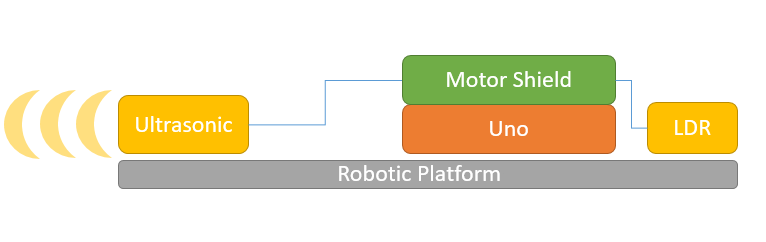
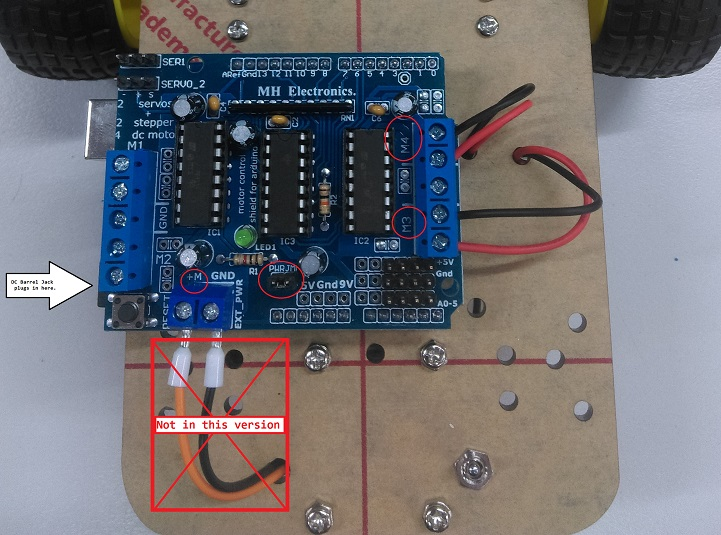

# Wall Dodging Robot

This clever robot is the perfect way to get started with robotics. The robot explores
its surroundings as it avoids obstacles and walls in its path. Starting with the
provided code, the robot can easily be expanded upon.

This is the updated version! codename `Mini-Tesla` - it now has a rechargeable Li-ion battery with an On-Off switch. It also now has a light sensor so it can turn off (or reverse) when it gets into dark places such as under beds or tables, and we use the motor shield to save space on the platform.

There's a lot more that this little robot can do, check out the [Exploration](#Exploration) section for more ideas once you have finished off the build.

- [Wall Dodging Robot](#Wall-Dodging-Robot)
  - [Bill of Materials](#Bill-of-Materials)
    - [You might also want](#You-might-also-want)
  - [Connection Table](#Connection-Table)
  - [System Overview](#System-Overview)
  - [Assembly](#Assembly)
    - [USB connector](#USB-connector)
    - [Assembling the Chassis](#Assembling-the-Chassis)
    - [Soldering the motor controller](#Soldering-the-motor-controller)
    - [Positing components and placing the switch](#Positing-components-and-placing-the-switch)
    - [Connecting the UNO/Motor controller](#Connecting-the-UNOMotor-controller)
    - [Attaching the sensors](#Attaching-the-sensors)
    - [Quick power test](#Quick-power-test)
  - [Programming](#Programming)
    - [Troubleshooting](#Troubleshooting)
  - [Exploration](#Exploration)

## Bill of Materials

| Qty | Code                                     | Description                 |
| --- | ---------------------------------------- | --------------------------- |
| 1   | [XC4410](https://jaycar.com.au/p/XC4410) | UNO board                   |
| 1   | [XC4442](https://jaycar.com.au/p/XC4442) | Ultrasonic Sensor           |
| 1   | [KR3160](https://jaycar.com.au/p/KR3160) | 2 wheeled robotic platform  |
| 1   | [MB3793](https://jaycar.com.au/p/MB3793) | Rechargeable battery pack   |
| 1   | [XC4472](https://jaycar.com.au/p/XC4472) | Motor Shield for arduino    |
| 1   | [PP0790](https://jaycar.com.au/p/PP0790) | USB A bare solder plug      |
| 1   | [WC7756](https://jaycar.com.au/p/WC7756) | USB Micro extension cable   |
| 1   | [ST0300](https://jaycar.com.au/p/ST0300) | Mini toggle switch          |
| 1   | [XC4446](https://jaycar.com.au/p/XC4446) | LDR sensor module           |
| 1   | [HM3211](https://jaycar.com.au/p/HM3211) | Vertical Header 28pin       |
| 1   | [WC6026](https://jaycar.com.au/p/WC6026) | Socket socket leads 40 pack |

### You might also want

- Some spare wires, [WH3025](https://jaycar.com.au/p/WH3025) is a good choice as it gives you a number of colours, 2 meters in length.
- Small hot glue gun ([TH1997](https://jaycar.com.au/p/TH1997)) or some extra hot glue ([TH1991](https://jaycar.com.au/p/TH1991))
- Bootlace crimps, for terminals: [PT4433](https://jaycar.com.au/p/PT4433)
- Double-sided tape: [NM2821](https://jaycar.com.au/p/NM2821)
- Extra mounting hardware, such as M3 nuts ([HP0425](https://jaycar.com.au/p/HP0425))

## Connection Table

The motor controller ([XC4472](https://jaycar.com.au/p/XC4472)) fits directly ontop of the uno so you don't have to worry about the pinout of the motor connections. The LDR and ultrasonic sensor ([XC4446](https://jaycar.com.au/p/XC4446) and [XC4442](https://jaycar.com.au/p/XC4442)) connect into the analogue pins on the motor shield, which don't have headers, but we can just solder them in with the [HM3211](https://jaycar.com.au/p/HM3211) vertical headers.

| UNO (shield) | Device          |
| ------------ | --------------- |
| A5           | LDR Sensor pin  |
| A4           | Ultrasonic TRIG |
| A3           | Ultrasonic ECHO |

Be sure to connect all of the 5V to the 5V pins, and the GND to GND pins.

## System Overview

The overall robotic platform is pretty easy to understand. we are using a battery to power the entire system by jacking into the motor controller. This means we have the most amount of current (which with lithium ion - could be a lot!) goes to the motors when we want it to. The LDR and ultrasonic sensor plug into the motor shield but they actually just get passed and controlled by the UNO underneath.

## Assembly

We've broken the assembly instructions into different sections so you can jump around if you need to:

- [USB connector](#USB-connector)
- [Assembling the Chassis](#Assembling-the-Chassis)
- [Positing components and placing the switch](#Positing-components-and-placing-the-switch)

### USB connector

Firstly, we'll assemble the USB connector. Looking at what's in the pack you should have 4 pieces as shown below.

USB is a common standard so we would do best to follow the standard by looking at what the pin out for a USB connector is, we are focused on "USB A" on the cable side, you can google for this easily:

Flip over the connector, so that the solder tags are facing you, (they have a 'u' shape) and you'll find that the leftmost connector (labelled `4` in the diagram above) is the ground connection. Strip a length of wire (either from [WH3025](https://jaycar.com.au/p/WH3025) or whatever you've got) and twist the wires so they all remain together. Then fill the 'u' shaped channel on the connector with a bit of solder.

Then, you'll be able to easily place the wire on top of the solder, and heat it through so that it gets absorbed by the melted solder. You can then put some fresh solder over the top so that it's secure in place and completely covered by solder.

As long as it's secure and there's no stray wires it should be ok. Continue to do the positive side, which is the opposite end of the connector. Here we used an orange colour to signify that it is not ground. It's important not to get the polarity wrong, so some sort of colour scheming should do good.

Then you can clip the small white cover on top, then place it into the large metal connector.

You should find that it only goes one way, and it must be flush on the USB connector side, as shown below.

Then you can place the other metal casing over it; This metal part "hooks" into it, as shown on the above picture, then it can swing close and become a bit tidy, enclosing everything in the metal housing.

Once it's all together, and snug, you can gently plug it in and test polarity with a multimeter if you want. It's crucial to get the polarity right; while this battery set up has plenty of protection to keep everything safe, not every battery does.

Once it's good, use a pair of pliers to gently wrap up the cable clamps to make it strong and sturdy.

Then you've finished the USB connector, this will be used to plug into the rechargeable battery later.

### Assembling the Chassis

In the Robot Chassis kit ([KR3160](https://jaycar.com.au/p/KR3160)) you should find some metal pieces and some long screws, along with the motor gearboxes. Bolt through the motor gearboxes onto the metal mounts as shown below.

We'll do this to both sides, so that they are opposing, with the top screw-mounts on opposite sides:

You'll find that there's only one real spot where the wheels will actually attach, and you can use the smaller screws to attach the motors to that point.

The gimbal wheel goes near the flat end of the robotic platform, and you can use the broad-headed screws to mount the wheel to the small brass spacers in the kit, like such:

Then use the remaining small screws to mount the wheel assembly to the chassis. If you have some spare washers or nuts, you can space them out a bit so that they fit more securely as shown below, or just mount it straight onto the chassis. It shouldn't cause a problem.

### Soldering the motor controller

The motor controller has plenty of connectors on it, however not all of them have the header pins. You should see 3 rows of 6 solder pads near the analogue connections on the motor controller, this is where we will use some of the [HM3211](https://jaycar.com.au/p/HM3211) pins to solder in.

Break off 3 lots of 4 pins. We are only using 4 as that's what we need, but you can break off longer segments if you want. Place one lot in through the top of the motor shield along the analogue connectors and flip the motor controller around so you can solder underneath as shown below.

It might be easier to start with the analogue connections first, then work your way away from the edge; here we've started on the GND row.

Tack them in and be sure not to short any of the connections. The connectors are already done on the board, so we don't need to make any new connections here.

### Positing components and placing the switch

Next up, we'll start positioning the components and building the on-off switch.

Cover the leads of the USB cable that you made previously, and connect both the USB cable and the USB extension into the [MB3793](https://jaycar.com.au/p/MB3793) battery pack. Lay out the components under the robot platform as shown below:

Here we've pushed the motor cables up and through the platform so they are on top, as well as put the USB extension under the 3rd wheel.

Use hot glue to mount the battery case and the USB extension lead in place, so that the battery pack is fairly centred and the usb lead is flush with the side of the robot, as shown below. Note where the switch will end up when we get to finally placing it.

Now you know the length of wire that you need, you can cut and strip a portion of wire so that you don't have too much wire between the battery and the switch, then solder to one of the side terminals on the [ST0300](https://jaycar.com.au/p/ST0300) switch.

Use some more black wire (signifying ground) to the middle terminal, and place the switch back in the hole near the 3d wheel. Use a spanner to tighten the top nut of the switch so that it is sitting firmly in place. You won't need the washers on the switch if they make it more difficult to attach.

Bring the new negative wire up through the same hole as the positive from the USB/battery bank. you should now have 6 wires coming to the top portion of the platform, 2 from each motor and the positive/negative from the USB cable in the battery bank.

### Connecting the UNO/Motor controller

Once the motor shield has been soldered and you're happy with it, you can place it on top of the UNO and mount the UNO to the robotic platform. We've found it nicer to mount the uno off to the side a little so that you can still program through the USB-B connector, so we use some double sided tape ([NM2821](https://jaycar.com.au/p/NM2821)) or hot-glue to keep it in place.

Connect the motors to the motor ports (M3 and M4) then connect the battery bank leads to the M+ and GND connections on the shield (remember polarity!). We've used bootlace crimps ([PT4433](https://jaycar.com.au/p/PT4433)) to make the connections extra secure as the terminals have something extra to grab on-to, but you could also bend the bare wires back a bit and double up inside of the screw terminal. Trim the wires to size as well, so that there's not too much loose wire hanging around. The polarity of the motors don't really matter, as you can just reverse them in code.

- Make sure that the "EXT_PWR" jumper is also connected so that the UNO feeds power off the motor controller power.
- If you were powering this off a battery that has more than 12v, you **need** to disconnect this jumper, but this battery is 5v so it is fine.

### Attaching the sensors

Next is just the ultrasonic and LDR sensors, which can be placed wherever you wish. Connect the `VCC` and `GND` from each sensor to the `5V` and `GND` on the motor shield, from the header connections that were soldered on previously, then connect the `S`, `TRIG`, and `ECHO` wires to the analog pins.

You can do any pin out, but our code sample has LDR on `A5`, `TRIG` on `A4` and `ECHO` on `A3`.

We used hot-glue to fix the sensors in position.

### Quick power test

Once everything is connected, you should be able to flick the switch to turn on the battery pack and find the motor controller and UNO lights up. Turn it off again to program. If you plug in a phone charger or otherwise to the side port, the battery bank should shine red to show that it is recharging.

## Programming

The source code is in the `robotCode` folder, which you can modify and upload. Once you've uploaded you should see the robot start driving and turn around if it reaches a wall. It will also stop moving if you turn the lights off, or if it goes underneath a table or bed.

### Troubleshooting

The arduino code has information showing in the serial monitor on `9600` baud. You can prop the motor up on a mug or box so that the wheels are off the ground, and see how it responds to moving your hand in front of the sensor, or covering the LDR with your fingers.

- If the robot does not move to begin with, it might be too dark for the robot already; shine a torch on the LDR of the robot to see if it moves
  - you can calibrate the `light_threshold` in the code to determine at what light level the robot stops moving.
- If the robot keeps hitting a wall, check to see if the robot will hit the wall when facing straight at it.
  - If it hits the wall, then make sure that the `ECHO` and `TRIG` pins are connected the right way, and see what the serial output says.

If the robot hits walls on an angle, it might not detect the wall properly, something similar to below:

The only way to combat this is to use two ultrasonic sensors on different angles, so that one of them is going to be a little more perpendicular to the side wall. You can also look in the below [Exploration](#Exploration) section for some ideas, such as using a servo to move the sensor to face the wall.

## Exploration

This is really meant to be a starting platform for robotics, as you can now change the robot in any way that suits; some ideas are below:

- [YM2758](https://jaycar.com.au/p/YM2758) Servo module
  - Attach the servo so that the ultrasonic can sweep across and look at other directions, a bit like the Ultrasonic radar project
- [XC4411](https://jaycar.com.au/p/XC4411) UNO with WiFi
  - Use the Uno with WiFi so that it can accept commands from a computer or phone, similar to our WiFi Rover project.
- [XC4385](https://jaycar.com.au/p/XC4385) Circular RGB LED Lights
  - Circular LEDS makes everything cooler, as it can give impressions on what it's doing or which direction it's travelling. This makes it similar to our [KR9262](https://jaycar.com.au/p/KR9262) robot as well.
- [XC4496](https://jaycar.com.au/p/XC4496) 3 Axis Magnetometer
  - Get a reading of what's north so the robot can find it's way throughout a maze or similar
